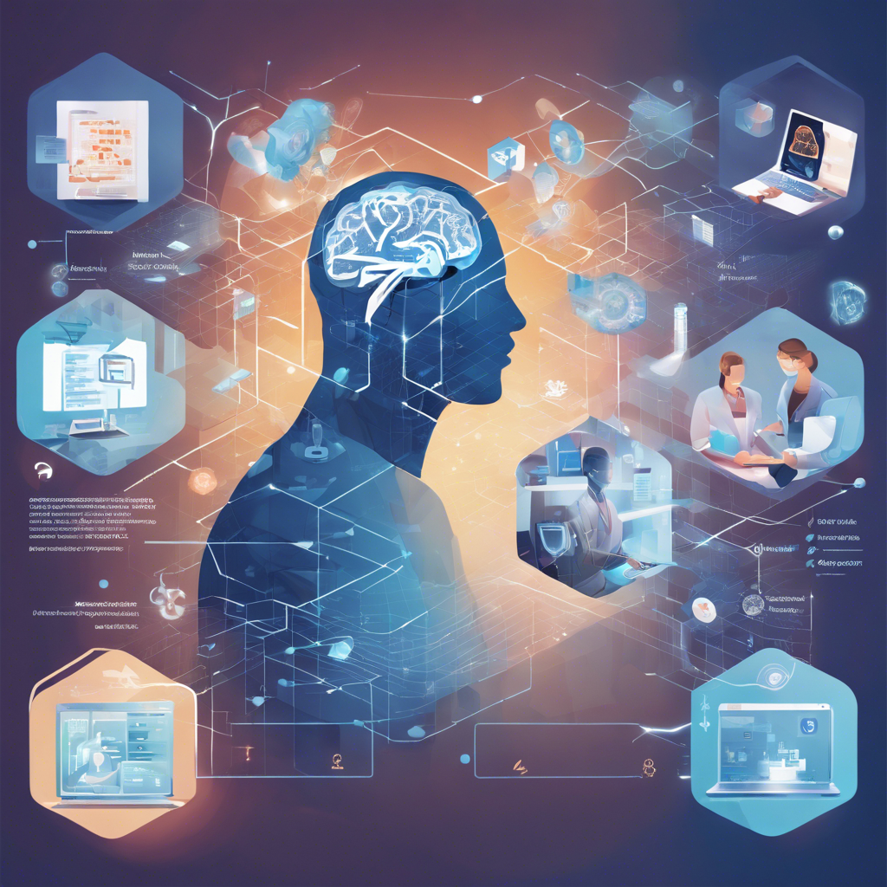

```markdown
# Título do Projeto Extremamente Aesthetic ;)

## 📒 Descrição
Este projeto explora o uso de Inteligências Artificiais (IAs) generativas para criar conteúdos realistas e inovadores. Utilizando IA para gerar texto descritivo e imagens, o objetivo é demonstrar como a IA pode ser aplicada em diversos setores de negócios e como ela pode auxiliar os humanos em suas atividades diárias.

## 🤖 Tecnologias Utilizadas
- **OpenAI GPT-4**: Utilizado para geração de texto descritivo.
- **GPT-4 ChatOn**: Utilizado para geração de imagens descritivas.
- **Pillow (PIL)**: Utilizado para manipulação de imagens.
- **Requests**: Utilizado para fazer requisições HTTP e obter imagens geradas.

## 🧐 Processo de Criação
### Geração de Texto
Utilizamos o GPT-4 para descrever a importância da IA em vários setores de negócios e ChatOn para gerar uma imagem descritiva sobre o texto gerado.

## 🚀 Resultados
Texto Gerado
### Descrições dos Setores:

1. **Setor Financeiro**: Detecta fraudes, gerencia riscos e otimiza investimentos com análise de dados em tempo real.
2. **Saúde**: Diagnostica doenças, personaliza tratamentos e prevê surtos através da análise de exames e monitoramento remoto.
3. **Varejo**: Melhora a experiência do cliente com recomendações personalizadas, chatbots e otimização de estoques.
4. **Manufatura**: Otimiza produção, manutenção preditiva e controle de qualidade com robôs e sensores.
5. **Transporte e Logística**: Otimiza rotas, prevê demandas e melhora a eficiência com veículos autônomos e gestão de frotas.
6. **Recursos Humanos**: Auxilia no recrutamento, análise de desempenho e retenção de talentos com algoritmos e ferramentas de análise.


Imagem Gerada


## 💭 Reflexão (Opcional)
Criar conteúdos realistas utilizando IA é um desafio que envolve a compreensão profunda das capacidades das ferramentas de IA e a elaboração de prompts precisos. Este projeto mostrou como a IA pode ser uma poderosa aliada na criação de textos e imagens, economizando tempo e ampliando a criatividade humana.
```
